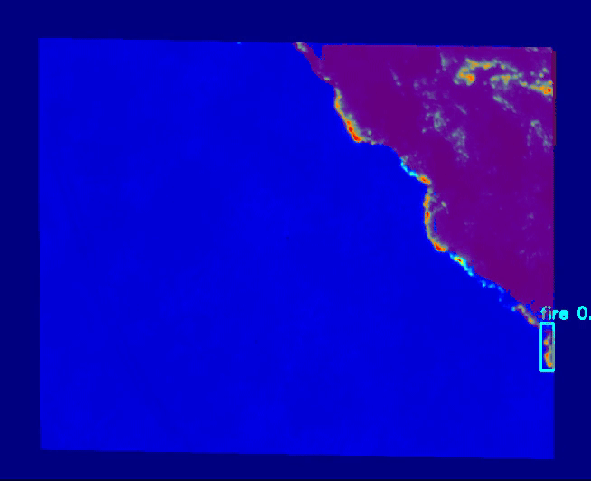
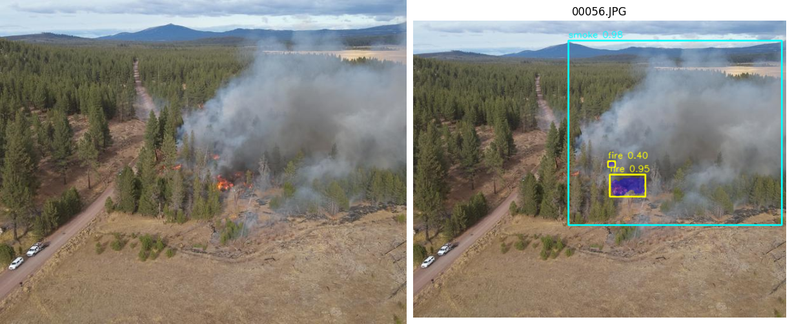
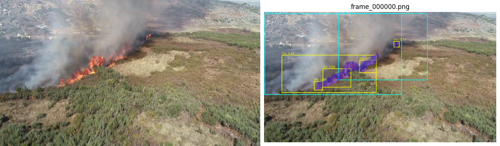
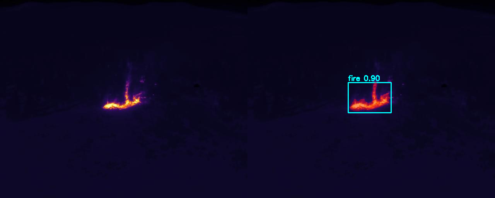
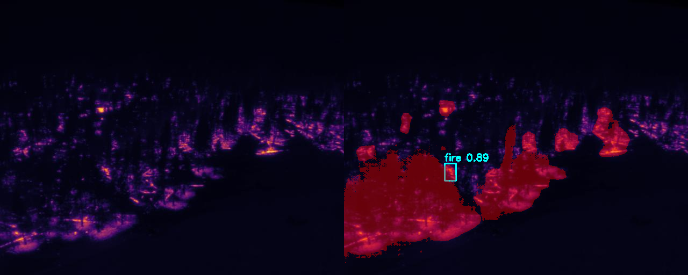
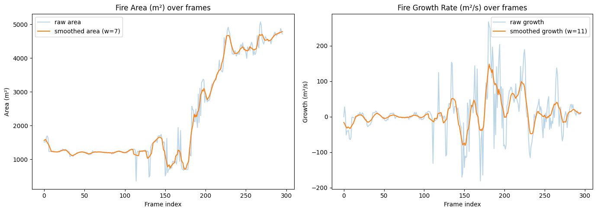

# Vision-Aided Wildfire Location and Area Mapping System




## Overview
This project is a computer vision system that automatically detects, segments, and geolocates wildfires from aerial imagery. Using both RGB (daytime) and Infrared (nighttime/thermal) data, the system identifies fire and smoke, then calculates the **burned area** in square meters and provides **GPS coordinates** of the fire front.

---

## Key Features
* Separate models trained for **Daytime** (RGB) and **Nighttime** (Infrared/Thermal) environments.
* Uses **SAM 2 (Segment Anything Model 2)** to refine bounding boxes into tight segmentation masks.
* Integrates **SAHI (Slicing Aided Hyper Inference)** to detect small or distant fires by processing high-resolution images in slices.
* Automatically calculates the surface area of the fire and converts pixel centroids to real-world GPS coordinates using affine transformations.

---

## Tech Stack & Pipeline

The processing pipeline consists of four main stages:

1.  **Detection (Detectron2):** A Faster R-CNN model trained on custom datasets detects smoke and fire, generating initial bounding boxes.
2.  **Slicing (SAHI):** Large aerial images are sliced during inference to improve detection accuracy on small fire pockets.
3.  **Segmentation (SAM 2):** Bounding boxes are passed to SAM 2, which generates accurate masks to isolate fire from the background.
4.  **Analysis:**
    * **Area:** Calculated using pixel-to-meter metadata from georeferenced images.
    * **Location:** Mask centroids are mapped to GPS coordinates using Coordinate Reference Systems (CRS).

### Datasets
* **Daytime Model:** Trained on **D-Fire** and **FLAME** datasets (~21,000 images).
* **IR Model:** Trained on **Fire Dataset Thermal DJI M30T** and **Infrared Fire CV Model** dataset.
* **Geolocation:** Validated using the **Flame 3** dataset (contains georeferenced metadata).

---

## Performance & Results

The models were evaluated based on classification accuracy and detection confidence.

### Daytime Model
* **Classification Accuracy:** **96.6%** (Fire/Smoke vs. Background).
* **Detection Confidence:** High confidence, with top detections scoring >92%.
* **Training Stability:** Converged with a total loss of **0.30**.

**Daytime Detection & Segmentation**



### Infrared (IR) Model
* **Classification Accuracy:** **95.0%**.
* **Foreground Accuracy:** **90.6%**.
* **Precision:** High precision, with many detection confidence scores reaching **99.7%**.

**Infrared Detection & Segmentation**



**Area Growth & Rate Of Spread**
The graphs below show the fire's area growth and rate of spread over time.
*Note: Sudden dips in the graph correspond to frames where the model did not successfully segment the fire.*



### Geospatial Data Output
The system generates a frame-by-frame analysis CSV (`results/ir_fire_geo_area_growth.csv`) containing:
* **GPS Coordinates:** Latitude/Longitude of the fire's centroid.
* **Area:** Calculated burn area in square meters ($m^2$).
* **Growth Rate:** Rate of spread ($m^2/s$).
* **Confidence Score:** Model detection confidence for each frame.

---

## How to Run

This project is configured to run in **Google Colab** using a GPU runtime.

### Prerequisites
* Google Account.
* GPU Runtime (T4 or better recommended).
* Libraries: `detectron2`, `sam2`, `sahi`, `torch`, `opencv` (installed via the notebook).

### Download Model Weights
The trained model weights (`.pth` files) are hosted externally due to file size limits. Download them from the link below and upload them to your Colab session:

* **[Download Pre-trained Weights via Google Drive](https://drive.google.com/drive/folders/1l8XdA_6_2WJjWoLl_LX5TYAgMWd16m25?usp=drive_link)**

### Quick Test
Sample images are provided in the `examples/` folder for testing without downloading external datasets.

1.  Download an image from [`examples/`](./examples).
2.  Upload it to the Colab notebook when prompted.
3.  View the generated masks and coordinates.

### Usage Steps
1.  **Open Notebook:** Upload `Daytime_Code.ipynb` or `IR_Code.ipynb` to Google Colab.
2.  **Upload Assets:** Upload the downloaded model weights (`.pth`) and your target image/video.
3.  **Setup:** Run the initial cells to install dependencies and configure the environment.
4.  **Inference:** Execute the main script to process the media. The system will output the visual results and the CSV data file.

---

## Future Improvements
* **Automated Router:** Implement a classifier to detect time-of-day (Day vs. Night) and load the appropriate model dynamically.
* **Web Interface:** Develop a Streamlit or Flask app to streamline usage and remove the need for manual Colab execution.
* **Mask Independence:** Investigate methods to calculate GPS/Area with reduced dependency on perfect segmentation masks to improve robustness in difficult visual conditions.

---

## Repository Structure

```text
Wildfire-Mapping-System/
├── assets/                      # Images for documentation
│   ├── daytime_before_after1.png 
│   ├── daytime_before_after2.png
│   ├── demo.gif                  
│   ├── ir_before_after1.png
│   ├── ir_before_after2.png      
│   └── Area_and_growth_graphs.png
├── examples/                    # Sample images for testing
│   ├── test_daytime.jpg
│   └── test_ir.jpg
├── metrics/                     # Training logs
│   ├── Daytime_metrics.json
│   └── IR_metrics.json
├── notebooks/                   # Source code
│   ├── Daytime_Code.ipynb
│   └── IR_Code.ipynb
├── results/                     # Evaluation outputs and data
│   ├── ir_fire_geo_area_growth.csv  
│   ├── Daytime_coco_instances_results.json
│   └── IR_coco_instances_results.json
├── .gitignore                   # Git configuration
├── README.md                    # Project documentation
└── requirements.txt             # Dependency list
```
---

## References & Datasets

This project was made possible by the following datasets and open-source libraries:

### Datasets
* **D-Fire Dataset:** [Download Link](https://1drv.ms/u/c/c0bd25b6b048b01d/EbLgD7bES4FDvUN37Grxn8QBF5gIBBc7YV2qklF08GCiBw)
* **FLAME Dataset:** [IEEE Dataport](https://ieee-dataport.org/open-access/flame-dataset-aerial-imagery-pile-burn-detection-using-drones-uavs)
* **Fire Dataset Thermal DJI M30T:** [Kaggle](https://www.kaggle.com/datasets/samarthjain247/fire-dataset-thermal-dji-m30t)
* **Infrared Fire Computer Vision Model:** [Roboflow](https://universe.roboflow.com/hanyang-university-fgjqu/infrared-fire/dataset/4/download)

### Key Libraries & Papers
* **Detectron2:** Wu, Y., et al. "Detectron2" ([https://github.com/facebookresearch/detectron2](https://github.com/facebookresearch/detectron2)).
* **SAM 2:** Ravi, N., et al. "Segment Anything Model 2" ([https://github.com/facebookresearch/segment-anything](https://github.com/facebookresearch/segment-anything)).
* **SAHI:** Akyon, F. C., et al. "Slicing Aided Hyper Inference" ([https://github.com/obss/sahi](https://github.com/obss/sahi)).

---

## Citation

If you use this project for research, please cite it as follows:

```bibtex
@software{VisionAidedWildfire2026,
  author = {Mhd Humam ZRDALI},
  title = {Vision-Aided Wildfire Location and Area Mapping System},
  year = {2026},
  url = {https://github.com/HumamZrdali/Vision-Aided-Wildfire-Location-and-Area-Mapping-System}
}